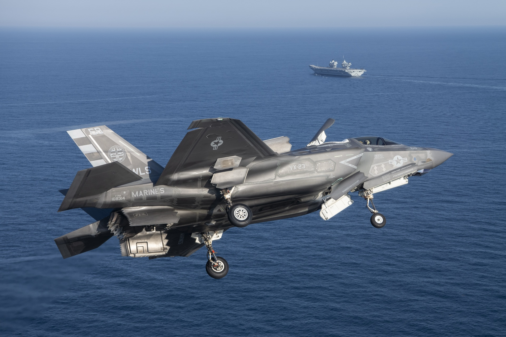

# F-35B VTOL RC Build



A multi-phase RC aircraft project culminating in a 3D-printed, VTOL-capable **F-35B**.
This repo is the single source of truth for code, component choices, pin mappings, wiring,
power architecture, and the reasoning behind every decision.

> **How to use this repo:** each doc in [`docs/`](docs/) covers one subsystem and opens with a
> short **"current decision"** callout, followed by the supporting analysis. When a decision
> changes, update the doc — keep it a reference, not a history log. The *history* — why decisions
> changed, plus build progress — lives in [`journal/`](journal/) ([decision log](journal/decisions.md)
> + [devlog](journal/devlog.md)).

## Project phases

| Phase | Build | Status |
|-------|-------|--------|
| 1 | Trainer prop plane (foamboard) | Built & repaired — awaiting re-flight (runway needed) |
| 2 | VTOL F-35B (3D-printed) | Primary focus / in design |

The trainer (Phase 1) validates basic flying and the FC/RX setup; the F-35B (Phase 2) is the real goal.

## Aircraft at a glance (Phase 2 F-35B)

- **Scale:** 70mm EDF class — ~700–800mm wingspan, ~900–1100mm fuselage, **~3445 g** AUW
- **Propulsion:** 2× QX-Motor 70mm EDF (main + lift), 6S, individual Hobbywing 100A ESCs
- **Hover control:** ArduPilot quadplane — 4-motor mix (main EDF vectored via 3BSM, front lift
  fan, 2× wingtip micro motors). See [Propulsion](docs/06-propulsion.md).
- **Flight controller:** CoreWing F405 WING V2 stack (FC + PDB PLUS + wireless), ArduPilot
- **Secondary I/O:** two RP2040 boards (WeAct avionics + Pi Pico servo bank) for extra PWM, temperature sensing, and LED control
- **Airframe:** LW-PLA print + carbon/aluminium spars + plywood reinforcement

## Documentation index

| # | Doc | Covers |
|---|-----|--------|
| 01 | [Project Overview](docs/01-project-overview.md) | Phases, goals, aircraft spec, open design questions |
| 02 | [Power System](docs/02-power-system.md) | Batteries, ESCs, BEC rails, connectors, current budget |
| 03 | [Flight Controller](docs/03-flight-controller.md) | CoreWing F405 stack, PDB, UART/ADC/PWM map, firmware |
| 04 | [Raspberry Pi Pico](docs/04-raspberry-pi-pico.md) | Pin map and roles (PWM expansion, temp, LEDs) |
| 05 | [Servos](docs/05-servos.md) | Flight-surface + VTOL servo assignment, torque math, STS3032 |
| 06 | [Propulsion](docs/06-propulsion.md) | EDFs, lift fan, 3BSM thrust vectoring, roll posts, trainer motor |
| 07 | [Sensors & Monitoring](docs/07-sensors-monitoring.md) | NTC temp + ACS712 current sensing, blackbox logging |
| 08 | [Lighting](docs/08-lighting.md) | Nav lights, strobes, 3W LEDs + drivers, Pico control |
| 09 | [Materials & Airframe](docs/09-materials-airframe.md) | Filaments, carbon/aluminium spars, bearings, fasteners, glue |
| 10 | [Wiring Diagrams](docs/10-wiring-diagrams.md) | Consolidated power/signal wiring and pin connections |
| 11 | [Bill of Materials](docs/11-bill-of-materials.md) | Master parts list with own/order status and cost |

Detailed per-part specs (weight, dimensions, electrical) live in [components/](components/) —
datasheet-style cards that back the BOM and feed the CG/AUW and power-budget math. Firmware lives
in [`code/`](code/) — the [Pico firmware](code/pico/) is not written yet (planned modules + wiring
recipes documented there).

## Adding images

Keep originals in `docs/img-high-res/<subfolder>/` (gitignored). Compress into `docs/img/<subfolder>/` before committing:

```bash
sips -Z 1920 -s format jpeg -s formatOptions 82 docs/img-high-res/vtol-day/photo.jpeg --out docs/img/vtol-day/photo.jpeg
```

## Conventions

- **Units & numbers** are kept as recorded during design (mostly metric, currency in €).
- ⚠️ marks unresolved risks or items needing verification before flight.
- 🛒 = to buy, ✅ = owned/decided.
