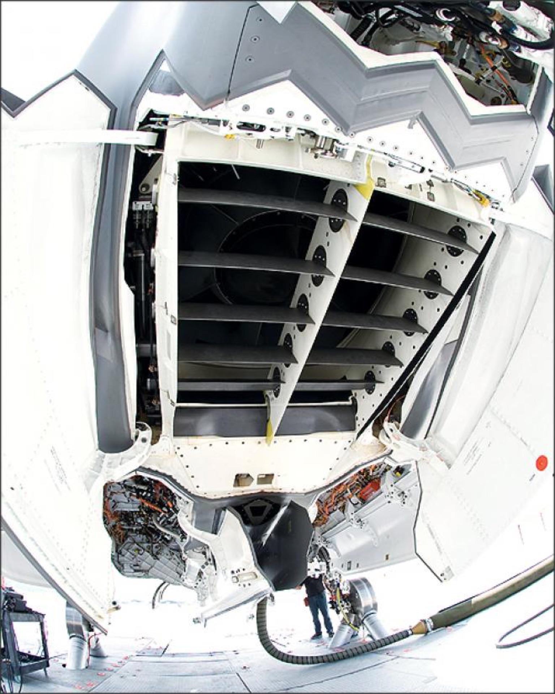

# Propulsion

> **Phase 2 F-35B:** 2× QX-Motor **70mm EDF** (6S) — one **main** (rear, thrust-vectored by the
> 3BSM) and one **lift** (front), each on its own Hobbywing 100A V2 ESC. Hover is flown as an
> **ArduPilot 4-motor quadcopter**: main EDF + lift fan + **2× small wingtip motors** for roll.
> **Phase 1 trainer:** A2212 2200KV + 3S + 30–40A ESC + 5×4–6×4 prop. The two systems are entirely
> separate.

## Phase 1 — trainer prop plane

| Item | Spec |
|------|------|
| Motor | A2212 2200KV |
| Battery | 3S LiPo — now using **CNHL MiniStar 850 mAh 3S** (earlier spec 1500–2200 mAh) |
| ESC | 30–40 A |
| Props | 5×4 to 6×4 |
| Airframe | Foamboard |

Purpose: learn to fly and validate the basic FC + receiver setup before VTOL complexity.
**Status:** built; first hand-launch (no runway) crashed after ~1 s from insufficient launch speed,
now repaired and intact — awaiting a re-flight from a proper runway. Battery: see
[CNHL MiniStar 850mAh card](../components/power.md).

## Phase 2 — EDF propulsion

| Item | Spec |
|------|------|
| Fans | 2× QX-Motor 70mm EDF |
| Motor RPM | ~50,000 RPM |
| Thrust | ~3300 g each |
| Current draw | ~72–89 A normal (peaks ~100 A) |
| Battery | 6S 5000 mAh ×2 (one per fan: main + lift) |
| ESC | 2× Hobbywing 100A V2, individual (not 4-in-1) |

The EDFs already produce a convincing jet sound across the throttle range (rising whine on spool-up,
turbine hum at idle, jet scream at full throttle, descending whine on spool-down). See
[Power System](02-power-system.md) for battery/ESC/connector detail.

## VTOL / hover control architecture

Hover is controlled as a **4-motor quadcopter** in ArduPilot — chosen after evaluating bleed-air
roll posts and finding them unworkable at RC scale (below):

| Hover "motor" | Hardware | Function |
|---------------|----------|----------|
| 1 | Main rear EDF | Lift + pitch, **thrust-vectored via the 3BSM** |
| 2 | Front lift fan | Lift (front) |
| 3 | Left wingtip micro motor | Roll |
| 4 | Right wingtip micro motor | Roll |

ESC throttle response is instant, vs slow servo-actuated vanes — which is why direct motors win for
roll. Yaw in hover comes from the 3BSM yaw element; pitch from the lift-fan/main-EDF balance.

### 3BSM — three-bearing swivel module

The main EDF exhausts through a **3-bearing swivel module** that vectors thrust from
horizontal (cruise) to downward (hover), mimicking the real F-35B nozzle.

- Driven by **one Feetech STS3032** smart servo (continuous rotation + built-in encoder); the three
  sections are **gear-coupled along their circumference** so a single motor rotates the whole
  nozzle. A separate **MG90S/SG90** tilts the whole 3BSM ±~15° for yaw. See
  [Servos](05-servos.md#3bsm-actuation--single-sts3032--gear-linked-sections).
- The section junctions run on the **4 mm loose ball race** (100 pc owned) in printed grooves —
  chosen for smoother rotation. (Caged **6805ZZ 37×25×7 mm** thin-section bearings were considered as
  an alternative but **dropped/not purchased**.) The balls are standardized 4 mm — no need to
  measure them. Design the groove for 4 mm + small clearance (groove radius ~2.15 mm as a starting
  point), print a test piece with 2–3 groove sizes, and validate fit once the balls arrive. The 3BSM
  can be modeled before the balls land; groove sizing just needs one print iteration.
- ⚠️ Reliability of the 3BSM under exhaust pressure is a key open risk — test thoroughly on the
  ground before any hover attempt. See [Materials & Airframe](09-materials-airframe.md) for bearings.

### Lift fan

Front-mounted EDF providing ~3300 g lift at peak, with actuated **lift-fan doors** (SG90) and a
**variable-area vane box** (MG90S) to modulate/redirect thrust. Balances against the rear 3BSM for
pitch in hover — driving the CG constraint (see [Project Overview](01-project-overview.md#cg-the-central-challenge)).

*Real F-35B with lift fan door open: the horizontal louvre-style vanes that redirect and throttle thrust downward. The vane box servo (MG90S) controls these collectively.*

### Roll control

**Decision: small dedicated wingtip motors, NOT bleed air.**

Bleed-air roll posts were researched (Eric Maglio's pioneering RC F-35B took several iterations and
ultimately abandoned them; the Resourcium build uses motors+props). At RC scale an EDF produces
near-0 PSI compression, ducting loses energy over its length, servo valves respond too slowly, and
bleeding air **reduces main lift**. Required roll moment ≈ 3400 g × 0.35 m arm → ~100 g+ thrust per
side; bleed air would deliver maybe 50–150 g with large losses — marginal at best.

Final plan (parts chosen):

- **2× 30mm 6-blade ducted fan, QF1611 7000KV (3S)** — ~220 g raw thrust → ~165 g after duct losses,
  ~11.2 A draw. Hidden inside the wingtips behind small inlet/outlet doors. **30 mm chosen over
  40 mm** (40 mm = more thrust/weight/cost than needed for roll authority).
- **ESCs:** 2× FVT **LittleBee 20A** (BLHeli_S/DSHOT) — bought separately (30 mm EDFs did not come bundled with ESCs). At 11.2 A on a 20A ESC they run ~56% — no heatsink needed.
- Cosmetic roll-post inlet/outlet doors on SG90.
- ArduPilot mixes them as quadcopter roll motors.

#### Roll-post power & wiring

- **Power source:** separate **3S 850 mAh** LiPo packs (CNHL MiniStar 70C, ~59.5 A capability — the
  30mm EDFs are 3S 7000KV). The packs shipped with XT30U but were **re-soldered to XT60H**, so
  roll-post power uses **XT60H**. See the [battery](../components/power.md) and XT60H connector cards.
- Power wire: **18AWG** is fine for ~11.2 A (16A ampacity, ~1.4× margin; ~0.05 V drop over 300 mm).
- **2 mm bullet** connectors for the EDF motor leads.
- **Pack count — DECIDED: one 3S 850 mAh feeds both roll posts.** Draw is ~22 A at nominal (~11 A
  each) rising to **~29 A at full 12.6 V** (~14–15 A each) → only **26–34C** of the pack's 70C, ample
  (≥2× margin). Full-throttle runtime is ~2 min (it's 850 mAh), but roll posts run in **short hover
  bursts** at low average current, so capacity is plenty. One shared pack also fails **symmetrically**
  (both roll posts together) — a per-side two-pack split was **rejected** because a dead pack would
  give an **uncommanded roll**. The **2nd 850 mAh is a spare.** Shared trunk = the pack's 14AWG lead;
  18AWG per-EDF branches.

## Open questions / TODO

- ⚠️ **Before first power-up:** set Hobbywing ESC **LiPo Cells → 6S** (currently factory default "Auto Calc" — must be changed manually via transmitter stick protocol or LED program box). See [ESC card](../components/propulsion.md) for the full parameter table and step-by-step procedure.
- ⚠️ Validate 3BSM thrust-vectoring reliability and bearing wear under exhaust on the ground.
- ✅ **Resolved: ArduPilot output mapping complete** — Lift fan=SERVO1 (Motor1), R roll post=SERVO2 (Motor2), Main EDF=SERVO3 (Motor3), L roll post=SERVO4 (Motor4), Q_FRAME_TYPE=0 (plus). See [Flight Controller](03-flight-controller.md#ardupilot-output-mapping).
- Tune lift-fan vane-box authority vs main-EDF balance for hover pitch.

## Related

[Power System](02-power-system.md) · [Servos](05-servos.md) ·
[Project Overview](01-project-overview.md) · [Materials & Airframe](09-materials-airframe.md) ·
[Bill of Materials](11-bill-of-materials.md)
