# Lighting

> **Current plan:** all lighting controlled by the **Pico/RP2040**. Nav/strobe lights use **3W
> LEDs** (red/green/white) on 700mA PWM constant-current drivers. A **10W landing light** runs on
> a 3A adjustable CC driver. An **automotive BA15S bulb** simulates the afterburner. A **12V COB
> strip** provides accent lighting, switched by an **IRLZ44N MOSFET**. Most lighting is powered
> from the PDB **12V VTX/CAM rail** — but see the afterburner power caveat.

## Inventory of light sources

| Light | Source | Driver | Power rail |
|-------|--------|--------|------------|
| Port nav | 3W LED red 625nm | 700mA CC, PWM | 12V VTX |
| Starboard nav | 3W LED green 520nm | 700mA CC, PWM | 12V VTX |
| Strobes | 3W LED white 6500K | 700mA CC; **hard on/off, both wingtips synced — 0.2 s on / 0.8 s off (20% duty, 1 Hz)** | 12V VTX |
| Landing light | 10W LED 6500K (XML-T6, 3A) | 3A adjustable CC, PWM | 12V VTX |
| Afterburner | BA15S P21W 12V auto bulb | built-in CC IC; **throttle-reactive** (brighter at higher throttle, PWM) | servo BEC / dedicated tap ⚠️ |
| Formation (exterior) | 12V COB strip (green, 3 mm), **diffused via frosted PP 0.5 mm** | IRLZ44N MOSFET switch | 12V VTX |

(3W LED stock: 10× each red/green/white. Diffusion via frosted **PP sheet** 0.5 mm.)

## Why 3W + PWM dimming

One LED type, brightness set per-channel by PWM on the driver: 3W @ 100% = bright strobe; @ ~30–40%
= nav-light level; @ ~10% = accent. High-power LEDs **cannot** connect directly to 12V (Vf
~3.2–3.4V) — each needs a **constant-current driver**, not a voltage regulator. A voltage regulator
on an LED causes thermal runaway → burnout.

## LED driver heat — efficient buck drivers (no big heatsinks needed)

Both LED drivers are **switch-mode step-down (buck) constant-current** drivers — **not linear**:

- 700mA nav/strobe driver (ACELEX 3W): ~**96%** efficiency, internal loss <1 W at a single-3W-LED load.
- 3A landing-light driver (eletechsup LD2740SC): ~**92%** efficiency.

So they **don't** dissipate the input–output voltage difference as heat, and input voltage (12 V vs
22 V) barely affects their temperature. At nav-light loads the small drivers **run cool — a heatsink
is optional**. (Powering from the 12V VTX rail is still the plan, but for current-budget/regulation
reasons, not driver heat.)

> **Correction:** an earlier design assumption (from the prior ChatGPT chat) treated these as
> *linear* regulators wasting ~11 W each at 22 V and concluded "must run off 12 V + heatsinks." That
> was wrong — the product datasheets confirm both are efficient buck CC drivers. Heatsinks are now
> only really needed for the **10W landing-light LED itself**.

**The real heat source is the 10W landing light** — at full 3 A the LED makes ~7–8 W. The **two
14×14×6 mm heatsinks on hand are adequate** for it — it's a
landing light, used in brief bursts. Rough thermal math at full 3 A (~7–8 W heat, still air): the
two heatsinks (~5–6 g aluminium) take ~540 J to rise +100 °C, i.e. **~1–2 minutes continuous from
cold** before the junction nears its 150 °C limit; real landing-light use is **10–30 s** and
in-flight gear-bay airflow cools it further. Always **thermal-glue the 10W LED to metal, never
directly to LW-PLA** (softens ~60 °C). Only step up to **≥20×20 mm — or PWM-dim to ~1–1.5 A
(~3 W)** — if you want the light on **continuously** (taxi/headlight use).

## Current budget (12V VTX/CAM rail, 2A)

| Load | Current |
|------|---------|
| Red + green nav (dimmed) | ~0.6–0.7A |
| White strobes ×2 | avg ~0.14A (10% duty), ~1.4A peak |
| COB strip | ~0.13A |
| 10W landing light | ~0.82A (intermittent) |

Nav + COB + strobe average ≈ **0.84A** ✅. Adding the landing light during approach pushes it up but
it's brief. The **afterburner bulb is the problem child**: rated 17–18W ≈ 1.4–1.5A, which alone
plus other loads exceeds the 2A rail.

### Afterburner power & the CANBUS-resistor mod

The BA15S P21W is an automotive LED bulb with a built-in **CANBUS load resistor** that *wastes*
power to fake an incandescent bulb's current draw for a car computer — useless here. **Remove it**
(open base, desolder the resistor that runs hot): actual LED draw drops from ~1.5A to **~0.7A**,
keeping it cool and within budget. Even so, **power the afterburner from the servo BEC or a
dedicated 12V tap, not the VTX rail** to avoid crowding it. The **BA15S** (straight pins, 180°)
variant is in the cart — easier to mount than BAU15S (offset). A purpose-made BA15S socket is
**optional**: solder leads directly to the bulb base contacts, or print a holder into the
afterburner housing. Amber/yellow (~3000K) gives the right glow.

## Wingtip quick-disconnect (detachable wings)

**Settled plan (12 Jul 2026):** if wings are made detachable for transport, only the **nav + strobe
LEDs** cross the wing-root joint — roll-post EDFs and all servos stay in the fixed fuselage/wing-root
section, so they don't need a disconnect at all. Each wingtip uses a **magnetic 3-pin pogo connector**
(9IMOD, [Servos component card](../components/servos.md)) wired as: shared GND (both LEDs' return) +
nav LED+ + strobe LED+. The ACELEX CC drivers stay **inboard** (not at the tip) — only their
already-regulated, already-PWM-dimmed output current crosses the joint, so no separate PWM wire is
needed there. 2 connectors total (one per wing). Bench-test the shared-ground current (~1.4A
worst-case, both LEDs on at once) before trusting it — the connector has no manufacturer current
rating.

## Pico/RP2040 control

```
Pico GPIO (PWM) → driver PWM input → controls brightness/strobe
PDB 12V        → driver input      → LED output
Pico GPIO      → IRLZ44N gate      → switches 12V COB strip on/off
```

Pin assignments (design values): GPIO 10 (red), 11 (green), 12 (strobe), 15 (strobe-enable alt).
See [Pico pin map](04-raspberry-pi-pico.md#pin-map--avionics-board-weact). The IRLZ44N is a logic-level MOSFET so a 3.3V
GPIO drives the gate directly.

```python
import machine, time
red_nav   = machine.PWM(machine.Pin(10)); red_nav.freq(1000)
green_nav = machine.PWM(machine.Pin(11)); green_nav.freq(1000)
red_nav.duty_u16(int(65535 * 0.4))
green_nav.duty_u16(int(65535 * 0.4))
strobe = machine.Pin(12, machine.Pin.OUT)
while True:
    strobe.on();  time.sleep_ms(50)
    strobe.off(); time.sleep_ms(950)
```

(Reference snippet above; the integrated Pico firmware will be written once components are in hand.)

## Notes & TODO

- Remove the CANBUS resistor from the afterburner bulb on arrival; wire it to servo BEC / dedicated tap.
- **Afterburner decided: throttle-reactive** — brightness scales with throttle (PWM from the Pico,
  mapped to the throttle channel), brightest at full throttle.
- 10W landing-light heatsink resolved: two 14×14×6 mm (stacked, on metal) for intermittent use.
- **COB strip decided: exterior formation lights** (green), **diffused through the frosted PP 0.5 mm
  sheet**. Cockpit glow was considered but dropped — not a priority and not very scale-realistic.
- **Strobe decided: hard on/off, both wingtips synced** — full brightness, **0.2 s on / 0.8 s off**
  (1.0 s cycle = 20% duty, 1 Hz), matching the real F-35 anti-collision strobe. The Pico toggles the
  driver on/off (not PWM-dimmed).

## Reference images

### Afterburner

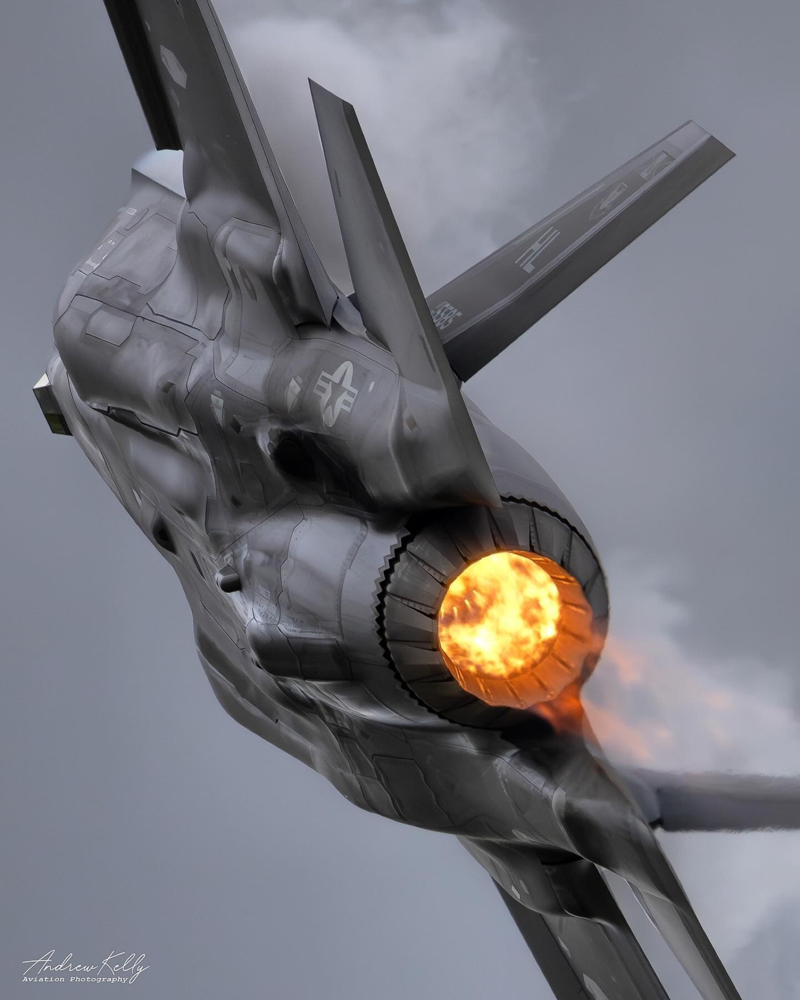
*Real F-35 afterburner — warm amber/orange, not blue-white. Target colour for the BA15S bulb.*

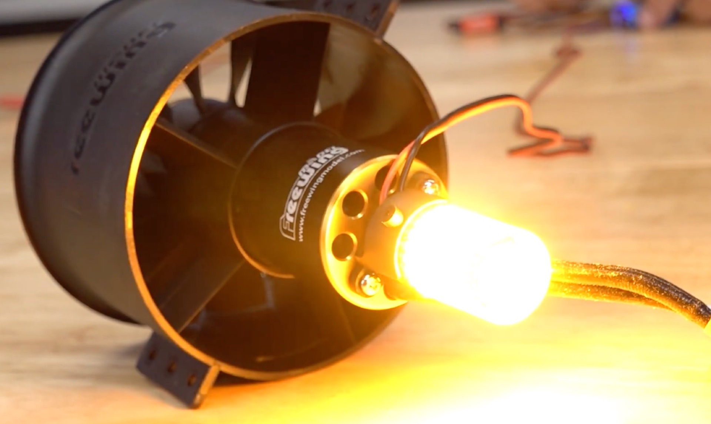
*RC EDF with automotive BA15S bulb lit — warm amber glow matches the real aircraft well.*

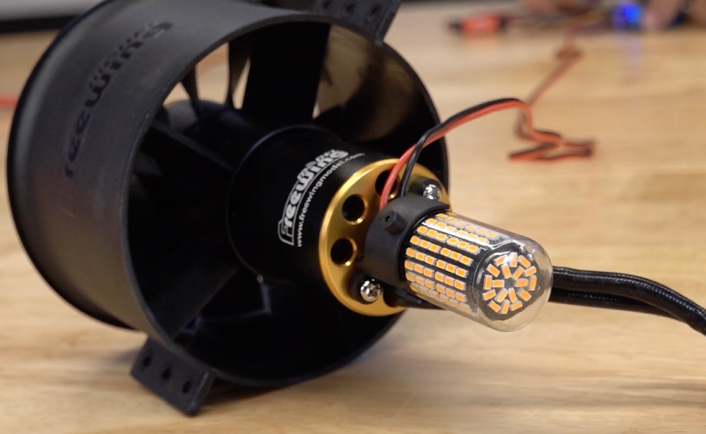
*Same setup unlit — shows how the bulb mounts at the motor hub inside the duct.*

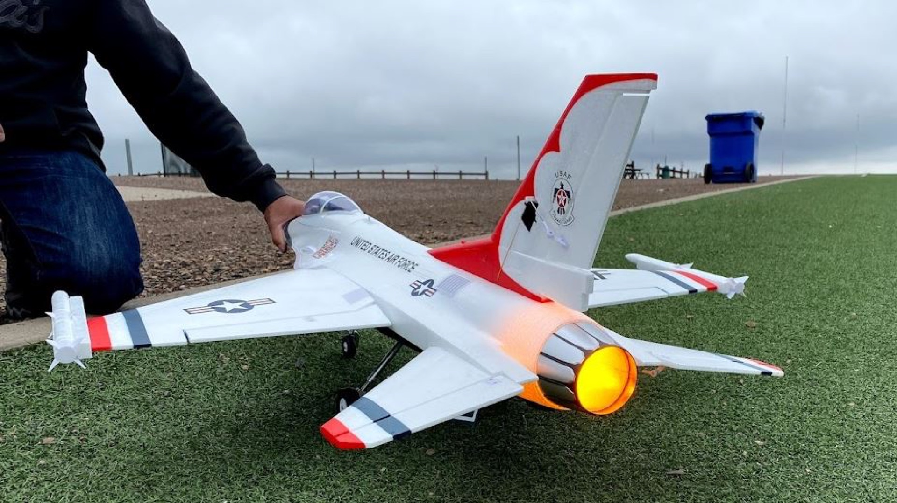
*RC F-16 with afterburner LED on — warm amber/orange glow from the nozzle, confirming the colour target even in a non-EDF installation.*

### Formation lights, nav lights & landing light

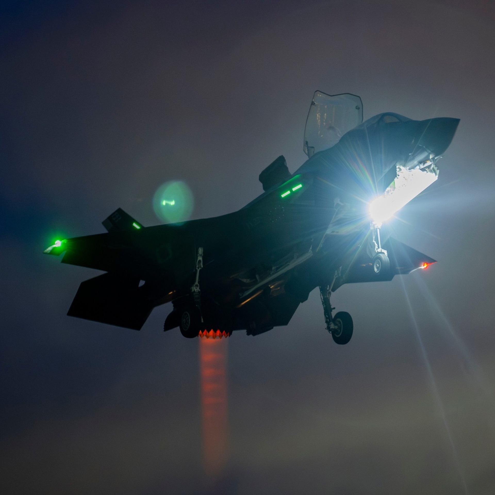
*Night VTOL approach: green formation strips along the fuselage top, green wingtip nav, blazing landing light on the nose strut, red/orange 3BSM exhaust glow below. All light types visible simultaneously.*


*Night taxi with all nav and position lights active — green formation strips on fuselage, red/green wingtip navs, and landing light illuminating the taxiway ahead.*

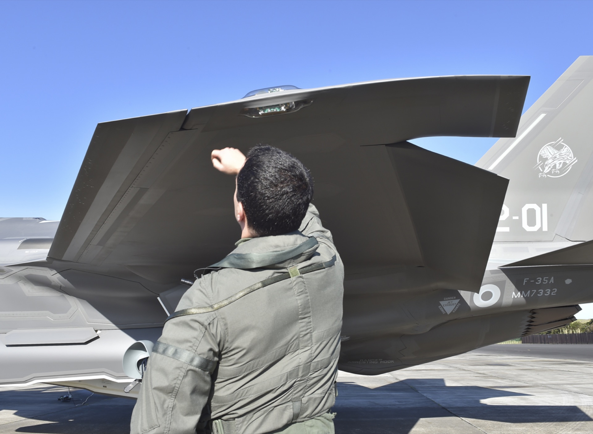
*Flush nav light installation — small aperture in the wing skin, no external protrusion.*

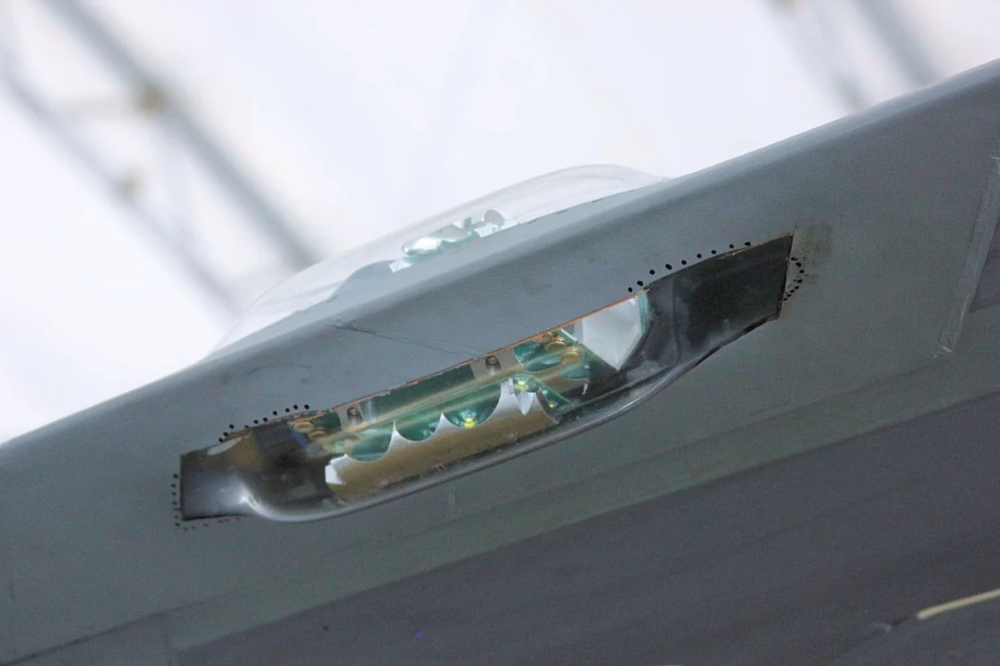
*Wingtip nav light close-up — LED array on a PCB strip with individual reflector cups, recessed behind a flush clear lens in the wingtip skin.*

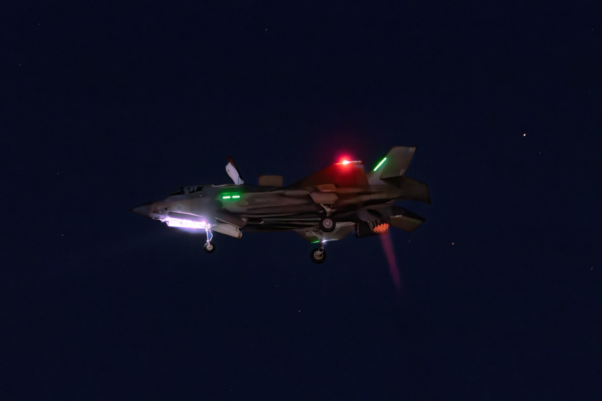
*Landing light during night VTOL approach — from below-front, showing the light mounted on the extended nose strut with gear fully down.*


*Night VTOL with landing light blazing — green formation strips, red collision light, and orange 3BSM exhaust glow all visible simultaneously.*

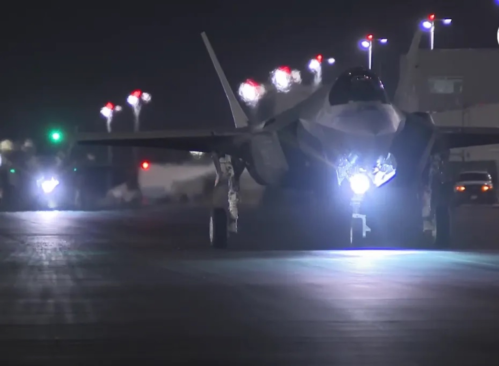
*Night taxi with landing lights at full power — note the intensity and forward beam spread from the nose-strut mount.*

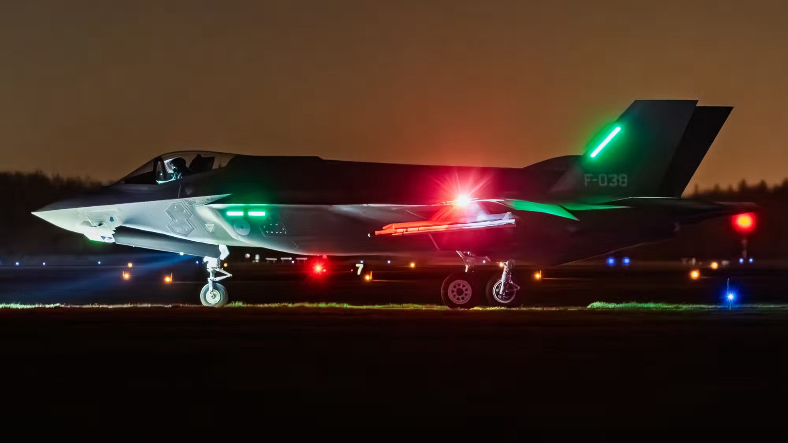
*Night ground roll showing all light types from the side — landing light, green formation strips, red/green nav lights, and red collision strobe all active.*

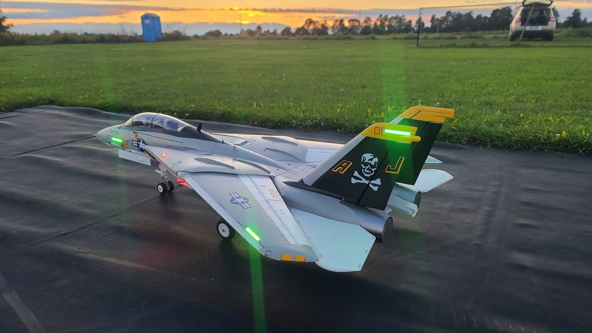
*RC F-14 at sunset with green LED formation strips along the fuselage spine, wing roots, and tail fins — shows how bar-style LED strips look integrated flush into printed/foam surfaces.*

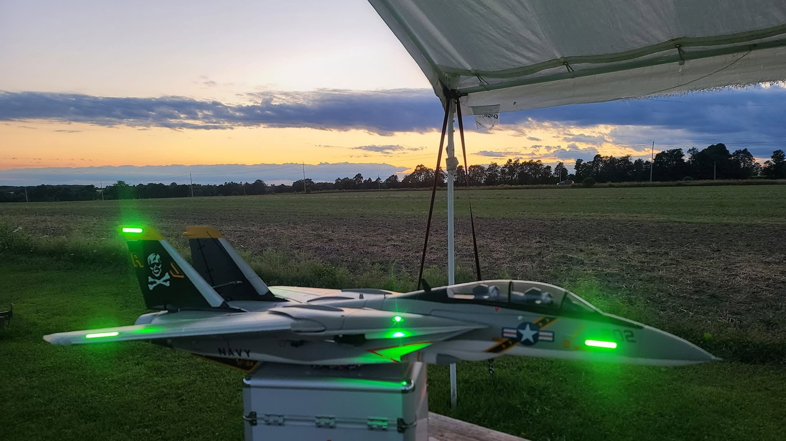
*Side profile under a field tent at golden hour — LED bar strips flush-mounted on vertical and horizontal stabilizers, and both wingtips.*

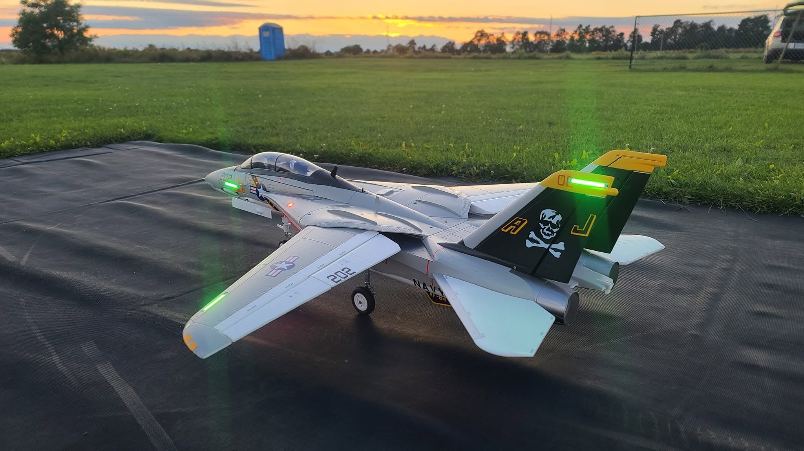
*Three-quarter rear view on a ground mat at sunset — green bar strips on both tail fins and wing trailing edges show the rear lighting geometry clearly.*

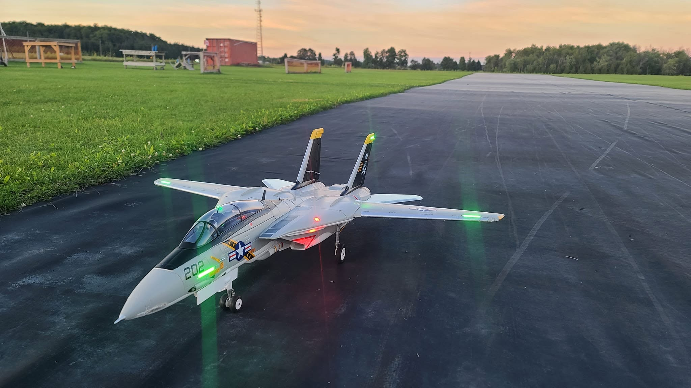
*Three-quarter front view at dusk on a tarmac runway — green formation strips on wings and nose, red collision light, and green nav point lights all active simultaneously.*
