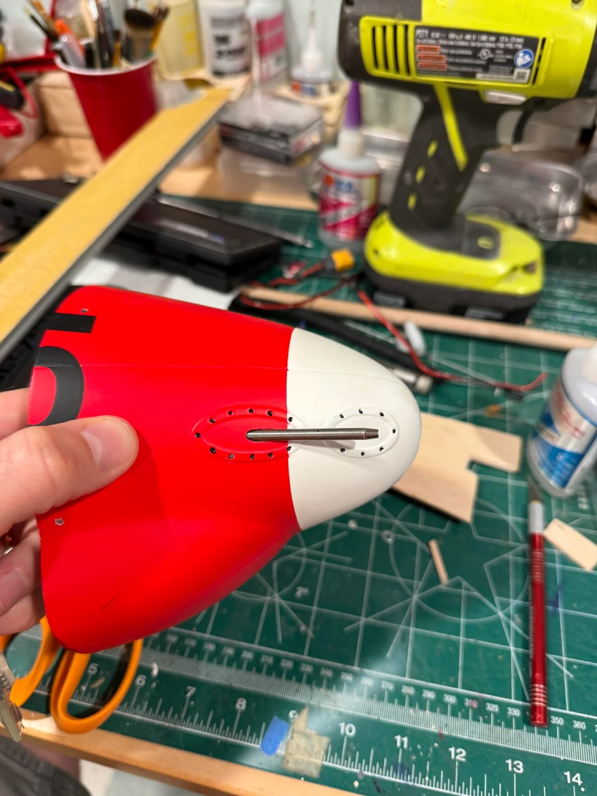
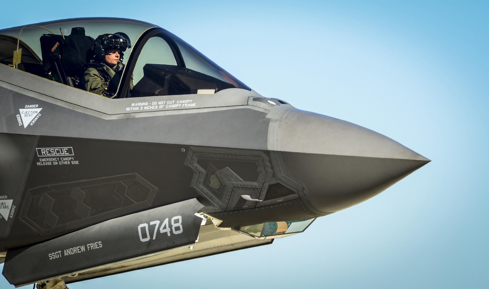

# Materials & Airframe

> **Current plan (Phase 2):** LW-PLA printed shell, XPETG for structural parts, **PA6-CF for the
> motor/ESC mounts** (the only genuinely hot parts — EDF exhaust is near-ambient, not turbine-hot).
> Spars from **16× 500×8×6 mm carbon tube** (8 mm OD /
> 6 mm ID), joined with the existing **6 mm OD / 3 mm ID** tubes as press-fit inner sleeves.
> Plywood reinforcement plates. **Phase 1 trainer is foamboard.**

## Printing Hardware

**2× Bambu Lab P2S** (enclosed CoreXY, 256×256×256 mm build volume, 300 °C max hotend, 600 mm/s),
each with a **Bambu Lab AMS 2 Pro** (4-spool active dryer, 65 °C, ceramic inlets).

- Both printers ship with a **hardened steel 0.4 mm nozzle** as standard — no upgrade needed for
  abrasive CF/GF filaments (PA6-CF, GreenTEC Pro CF, PA6-GF).
- AMS 2 Pro ceramic inlets (1200 Vickers) protect the full feed path on abrasive materials.
- AMS 2 Pro active drying (65 °C, rotating spool) covers the mandatory pre-dry for PA nylons
  before printing — no separate dryer box needed.
  - ⚠️ **Caveat: 65 °C is below the 70–80 °C this doc specs for PA drying.** The AMS at 65 °C is
    enough to *maintain* an already-dry spool during a print, but a fresh/opened roll that has
    absorbed moisture may not fully dry at 65 °C. Wet nylon-CF prints stringy, weak, and pops/hisses
    on extrusion. For the **first dry of a damp spool**, use a dedicated dryer at 75–80 °C (12 h),
    then keep it in the AMS to hold it dry. The P2S is also **passively** enclosed (no active chamber
    heater like an X1E) — fine for small motor/ESC mounts, but large flat nylon parts can still warp
    slightly. Bambu has no tuned system preset for PA6-CF — start from a generic PA-CF profile and
    expect to tune. Textured PEI plate + glue stick for adhesion.

## Filaments

### Owned / in hand

**eSUN LW-PLA, black, 1 kg × 2 rolls** — main airframe shell (foaming PLA, ~0.54 g/cm³ foamed at
260–270 °C). Full spec on the [eSUN LW-PLA card](../components/structural.md). ⚠️ Needs an
**all-metal hotend** to foam properly (>250 °C); retraction is ineffective so expect stringing.
A big advantage of a printed airframe: servo bays, internal pushrod channels, and horn slots can
be designed straight into the print (see [Servos — internal actuation](05-servos.md)).

⚠️ **Run LW-PLA from an external spool, NOT through the AMS.** Two reasons specific to foaming
filament: (1) the AMS 2 Pro's 65 °C active drying sits on the spool — LW-PLA is heat-activated, so
warming it in the box risks premature/inconsistent foaming; (2) foaming PLA + the AMS Bowden/buffer
path + ineffective retraction = feed and stringing trouble. Keep the AMS for the PETG/nylon/GreenTEC
rolls.

### STUHI sponsorship — extrudr filaments (all 1.75 mm, up to 1.1 kg spools)

STUHI (the community behind this project) received 8 rolls of extrudr filament as sponsorship.
These are available to the build in reasonable quantities (not 100% of each roll).

| # | Filament | Colour | Best use in this build |
|---|----------|--------|------------------------|
| 1 | **FLEX SEMISOFT** | Black | Vibration-isolating mounts, servo grommets, landing gear bump stops |
| 2 | **FLEX MEDIUM** | Transparent | Flex joints, dust/water seals, wiring strain-relief clips |
| 3 | **DuraPro PA6-CF** | Black | EDF motor mount, structural brackets — very stiff, heat-resistant |
| 4 | **DuraPro PA6-GF** | Nature | Secondary structural parts, spar collars, bulkheads |
| 5 | **DuraPro PA12** | Black | Parts needing impact resistance and light flex (landing gear struts) |
| 6 | **GreenTEC Pro** | Silver | Cosmetic panels, scale detail parts — silver matches bare metal areas |
| 7 | **GreenTEC Pro CF** | Carbon/black | High-load structural parts as ASA/ABS replacement; good heat resistance |
| 8 | **XPETG Matt** | White | Structural parts + **white base coat** option for the final livery |

**Key notes:**
- **"Heat-critical" here = the motor mount + ESC mount only.** An EDF exhaust is electric — the air
  leaving the duct is near-ambient (~40–60 °C), *not* turbine-hot. The only genuinely hot parts are
  the **EDF motor mount** (motor 80–100 °C under load) and the **ESC mount**. Everything else people
  instinctively call "near the exhaust" — ducting, nozzle shroud, fairings — is fine in **XPETG**.
  Reserve the scarce **PA6-CF / GreenTEC Pro CF** for those two mounts; don't spend it on warm-ish
  parts PETG handles. (PA6-CF for the vibrating motor mount — tougher; GreenTEC Pro CF for rigid
  non-vibrating brackets — stiffer but more brittle, and anneal it to realise its heat resistance.)
- **XPETG Matt White** opens the *white-base + paint* airframe colour path (see below) without
  buying a separate white roll; matte surface also takes primer better than gloss PETG.
- **FLEX SEMISOFT/MEDIUM** fill a gap not covered by the eSUN stock — vibration isolation and
  compliant parts.
- PA nylons (PA6-CF, PA6-GF, PA12) must be **dried before printing** (12 h @ 70–80 °C); keep in
  sealed bags with desiccant between sessions.

### Filament-to-role mapping (summary)

| Role | Filament |
|------|----------|
| Main airframe shell | LW-PLA (eSUN, black, in hand) |
| Structural parts, 3BSM, ducting / nozzle shroud / fairings | XPETG Matt |
| Spar collars / saddles, bulkheads | DuraPro PA6-GF |
| EDF motor mount (hot + vibrating) | DuraPro PA6-CF |
| ESC mount / rigid high-load brackets | DuraPro PA6-CF (vibration) or GreenTEC Pro CF (rigid) |
| Landing gear struts | DuraPro PA12 |
| Cosmetic / silver panels | GreenTEC Pro Silver |
| Vibration mounts, seals | FLEX SEMISOFT / FLEX MEDIUM |
| Canopy vacuum-form box (if printed) | XPETG Matt or PA6-GF |

### Final airframe colour: gray vs paint

Black LW-PLA is **test/first-airframe only** (low HDT ~53 °C → can soften in strong sun; fine in
weak Finnish sun and for testing). Once the airframe is proven to fly well, pick the final finish:

- **Gray LW-PLA** — closest to the real F-35B colour out of the spool; no paint step, no added paint
  weight, but limited to that one grey.
- **White LW-PLA + paint** — full control of the scale livery (panel lines, markings, exact greys),
  but adds paint/primer weight and work, and LW-PLA's matte foamed surface needs care when painting.

**Decision: pending** — choose after the first airframe flies. Leaning gray for simplicity/weight if
the shade is close enough; white+paint if a faithful livery matters more. (To revisit.)

## Carbon fibre / structural rods & tubes

**Rule:** tubes for spars (stiffer per gram — hollow = better strength-to-weight), solid rods for
pushrods (compression/tension).


| Property | Pultruded tube | Roll-wrapped tube |
|----------|---------------|-------------------|
| Axial tension (pulling) | ★★★★★ Excellent | ★★★★☆ Very good |
| Axial compression (pushing) | ★★★★★ Excellent | ★★★★☆ Very good |
| Simple bending | ★★★★★ Very stiff | ★★★★☆ Good–excellent |
| Torsion (twisting) | ★★☆☆☆ Fair | ★★★★★ Excellent |
| Radial crushing (clamps, bolts) | ★★☆☆☆ Fair | ★★★★★ Excellent |
| Multi-directional loads | ★★☆☆☆ Fair | ★★★★★ Excellent |
| Impact resistance | ★★☆☆☆ Lower | ★★★★☆ Better |

> All CF tubes in this build are **pultruded** — excellent for the bending loads spars actually carry.
> Weak spots: radial crushing at mounting points → always use printed collars/saddles, never bare metal screws clamping directly onto the tube wall.

### Owned

- **10× CF tube, 6 mm OD / 3 mm ID, 400 mm** — used as **press-fit inner sleeves** to join the
  500 mm main tubes (the 6 mm OD slides into the 6 mm ID main tube with ~0 mm gap), plus secondary
  structure, 3BSM supports, ribs/formers.

### Ordered (24 Jun 2026)

- **16× CF tube, 8 mm OD / 6 mm ID, 500 mm** (1 mm wall) — **main spars & fuselage spine**, joined
  in pairs into ~900 mm runs (see spar plan below).
- **10× CF rod, 2 mm × 250 mm** (solid) — pushrods / control linkages.

### Spar plan (final) — 16× 500×8×6 mm joined with 6 mm sleeves

The F-35B is ~1 m long, so a single 500 mm tube is only half a span/length — each full run is
**two 500 mm tubes joined**. Plan ~4 full runs (main spine, wing spar L+R, secondary spine, wing
secondary), so **8 tubes minimum**; the **16-pack (€33.71)** gives all runs plus spares and is far
better value than the 4× 10×6.1 mm option (€25.68, zero spares).

| Use | Spec |
|-----|------|
| Spars / spine (main tubes) | **8 mm OD / 6 mm ID, 500 mm** (1 mm wall), joined in pairs |
| Joining sleeve | existing **6 mm OD / 3 mm ID** tube, ~80–100 mm, ~50 mm into each side |
| Pushrods / linkages | 2 mm CF rod (have 2×250 mm 10-pack) |

**Wall thickness:** 8×6 mm is a **1 mm wall** — adequate for fuselage spines; for the most
wing-loaded spar, either run **two 8 mm tubes side-by-side** (≈ one 10 mm tube) or accept the 1 mm
wall given the joined-tube approach. (The earlier 10×6.1 mm / local-aluminium options are dropped.)

### Joining method (press-fit sleeve + epoxy)

```
[8mm tube A] ──[6mm OD sleeve, ~50mm each side]── [8mm tube B]
```

The 6 mm OD sleeve in the 6 mm ID tube is a **0 mm-gap interference fit** — ideal: maximum contact,
epoxy works in **shear** (strong) not tension, carbon-on-carbon. If too tight to slide, lightly sand
the sleeve or gently warm the outer tube. **Use 2-part epoxy** (5-min is fine) for spar joints —
*not* CA (brittle under vibration). Sand mating surfaces, glue, align straight, cure fully before
loading. Resulting run ≈ 900 mm. Budget ~35 ml epoxy total (~5 ml/joint).

## Bearings & 3BSM rotation

- **3BSM swivel — loose ball race:** the main 3BSM rotation runs on **4 mm loose steel balls
  (100 pc)** in a printed race, chosen deliberately for smoother rotation. Design the printed
  grooves around the 4 mm ball diameter.
- **MR62ZZ (2 × 6 × 2.5 mm)** bearings are kept as **backup / for small gears**, not the main swivel.
- **6805ZZ thin-section (37 × 25 × 7 mm)** was considered for full-section caged duct bearings but
  **dropped — not purchased**; the loose 4 mm ball race is used at the junctions instead.
- ⚠️ **Finalise the bearing/ball-race geometry before modeling** the 3BSM — design the seats and
  grooves around the real ball/bearing dimensions.

See [Propulsion — 3BSM](06-propulsion.md#3bsm--three-bearing-swivel-module).

## Landing gear hardware

- **Wheels:** standard **off-the-shelf RC-plane wheels** (no O-ring tricks, not printed/cast). **38 mm PU
  pair (ordered 24 Jun 2026)** = F35B **nose gear** (scale-matched, 2.1 mm bore → 2 mm axle). F35B
  **main gear** → order **~55/56 mm** later (cheap when in stock on AliExpress). The owned **45/50 mm
  pair is on the trainer** (45 mm nose, 2× 50 mm main), not the F35B.
  - COTS chosen over silicone-cast or TPU-printed wheels — cheap, proven under landing loads, no
    print/tuning fuss. Custom TPU stays a later option if scale accuracy demands it (of the Extrudr
    flex rolls, Semisoft A85 is too soft to bear load; Medium A98 is firm enough but transparent).
    See [decisions](../journal/decisions.md).

## Fasteners

- **Stainless button-head kit, 600 pc**: M2/M3/M4/M5 in 8/12/16/20 mm + washers — covers 3BSM,
  servo/ESC/EDF mounting, carbon-tube clamps, landing gear, general airframe. Stainless chosen over
  zinc (no rust from exhaust condensation).
- ⚠️ Confirm **M2 nuts** are included (needed to secure 3BSM from both sides).
- **STUHI hardware lab likely covers general fastener needs** (screws, heat-set inserts, standoffs,
  nuts, bolts, common sizes) — check there before buying the 600pc kit; may make it unnecessary.
  Still worth confirming the specific **M2 nuts** for the 3BSM are actually on the shelf there too,
  since that's a named risk item above.
- Linkage hardware: 2 mm linkage rods, clevises, M2 threaded rod for adjustable linkages.

## Adhesives & misc

- **CA glue: Deli 502** (15 g ×3) for foam/CF fast bonding and panels.
- **2-part epoxy: Biltema Pika Epoksi** (2×21 g, 20-min working time, transparent, gap-filling) —
  structural bonds / spar joints / tube sockets. CA is too brittle for spar joints. One pack
  (42 g) should cover all spar joints + sockets (~35 ml needed); buy a second as backup. Leave
  clamped 24 h before loading for full strength. 🛒 not yet ordered. €3.55 / pack.
  [Biltema](https://www.biltema.fi/rakentaminen/liimat/epoksiliimat/pika-epoksi-2-x-21-g-2000050118)
  — per SDS (both parts, ⚠️ sold under two Biltema names, same article no. 36-2361/composition:
  "Pika Epoksi Perus/Kovetin" and "Epoksi Supervahva A/B"): dynamic viscosity ~11,000–16,000 mPa·s
  both parts (thick/honey-to-peanut-butter — matches the gap-filling spec and won't run out of
  the vertical sleeve joint before cure). Resin side (Perus/A) is a skin sensitizer (H317, can
  cause an allergic reaction with repeated contact) — glove up every time, not just for a one-off
  job. **Gloves: NBR (nitrile), 0.2 mm, >240 min breakthrough** — any standard nitrile glove
  clears this. SDS gives no cured-joint heat rating (flash/boiling point data is for the
  uncured liquid, irrelevant here) — standard epoxy softens ~50–70 °C once cured, so keep spar
  joints away from EDF/exhaust heat if routing allows it.
- **Frosted PP sheet 0.5 mm** (100×200 mm, 10 pc) — LED diffuser.
- Silicone tubing 25–30 mm ID (was for bleed-air ducts — **obsolete** now roll posts use motors,
  see [Propulsion](06-propulsion.md#roll-control)).

## Canopy (transparency)

> **Current plan:** single-piece clear **PETG, 0.5–0.75 mm**, heat-formed over a positive 3D-printed
> plug. **V1: removable, magnet-located** (no servo); **powered opening deferred to V2.** Forming
> method = DIY vacuum forming; the vacuum-box material is **still undecided** (see below).

### Material & thickness

- **PETG, clear, 0.5–0.75 mm.** PETG is chosen *because of the forming method*, not in the abstract:
  wide forming-temperature window, very forgiving, no pre-drying needed, clear enough at viewing
  distance. It is the RC community default for heat-/vacuum-formed canopies.
- **Acrylic (PMMA)** is what real canopies and the best RC bubbles are made of, but it shatters if
  cold-bent and needs an oven + tight temperature control — wrong tool for a hobby heat/vacuum setup.
  **Polycarbonate** must be dried before forming and has a narrow window (~50% failure rate even for
  experienced builders). Both rejected for this build.
- **Thickness:** 0.5 mm forms easiest and is structurally fine — wind load on a ~50 cm² canopy at RC
  cruise (~100–150 km/h) is trivial. 0.75 mm adds rigidity. *Scale thickness math is a red herring*
  (real F-22 canopy 19 mm ÷ ~15 ≈ 1.3 mm) — optical scale thickness is invisible at viewing distance,
  and thicker sheet is heavier on the nose, harder to form, and more optically distorting. Go thin.
- **Tint:** clear, or a *very* light smoke at most. The real F-35 canopy's blue/purple iridescence is
  a thin-film vapour-deposited coating — not replicable with hobby materials and not worth faking. A
  heavy tint would also hide the cockpit screen, which is the more impressive detail. See the
  [cockpit TFT filter note](04-raspberry-pi-pico.md#4-cockpit-tft-display).

### Single piece

Form the canopy as **one piece.** The real F-35 canopy is a frameless single bubble — splitting it
into a windscreen + canopy would *add* a seam the real aircraft doesn't have, and one bubble is also
easier (one plug, one pull) and optically cleaner (no join line to glue/align). The long, shallow
F-35 profile is forgiving to form; keep the plug's rear taper gradual so the sheet pulls in instead
of bridging.

### Opening vs fixed (V1 scope)

A powered opening canopy is a very cool scale detail, but its real cost is **one scarce Pico PWM
channel** plus a hinge mechanism — which is exactly why it was cut from V1 (servo budget short by
6–9 outputs, see [Pico](04-raspberry-pi-pico.md) / [Servos](05-servos.md)). **V1 plan: removable,
located by the owned N35 5×2 mm magnets** (see [Magnets](#magnets) below) — lift off by hand to show
the cockpit, self-aligns on replacement, zero servo/channel. **Powered opening = V2** once the pin
budget is resolved; it stays a single piece glued to a hinged printed sill either way.

### Forming method — DIY vacuum forming (default) or Aalto Fablab (better, if accessible)

> **Aalto Fablab option:** the lab's **CR Clarke 750FLB** vacuum former would skip the whole
> plenum-material decision below — sealed chamber, perforated platen, and a real vacuum pump already
> built. Forming area 432×482 mm / 140 mm mold height comfortably clears the ~220×80 mm canopy
> footprint, and clear PET-family sheet (our PETG plan) is allowed (only PVC is banned on that
> machine). Catch: not an Aalto student, so access is **Public Open Days only** — first-come,
> lab-master-supervised, no advance booking — and the lab does a **summer/maintenance shutdown
> (22 Jun – 28 Aug 2026)**, so this isn't available right now. Bring the sanded/undersized printed
> plug plus **your own sheet** (they don't stock clear plastic, only opaque polystyrene). Treat this
> as the better option *when* an open day lines up with the build; the DIY box below is the fallback
> that doesn't depend on lab access.

The DIY plan is **vacuum forming**, which gives far more even, crisp results than heat-gun draping (a
single nozzle pulls at one point and leaves the rest of the sheet loose/wrinkly). Principle: a sealed
air chamber (**plenum**) with a perforated top, the plug sitting on the perforated surface, and a
vacuum emptying the chamber so atmospheric pressure presses the heated sheet uniformly onto the plug.

Setup, all room-temperature except the sheet:

- **Plug:** solid 3D-printed canopy shape (LW-PLA or PLA), sanded smooth, slightly undersized, raised
  a few mm on standoffs / a small base so air reaches its edges, with release agent (wax/vaseline).
- **Box (plenum):** sealed chamber, hole grid (~1–1.5 mm, ~10–15 mm spacing) in the flat top over the
  plug footprint, one hose port in the **side or bottom** (never the top). Must be reasonably airtight
  *everywhere except the hole grid* — leaks steal suction. **Material undecided:**
  - *Plastic tub* — cheapest, already airtight, just drill a lid + side hole. Front-runner for cost.
  - *3D-printed box* — easiest clean hole grid + integral tapered hose port + plug standoffs, but
    **filament cost is significant** at canopy footprint (~220×80 mm, likely a 2-piece print on most
    beds) and FDM walls are porous (need 4+ perimeters + an inside epoxy wipe to seal). **Not locked
    in** pending the cost call.
  - *MDF/ply box* — classic, cheap, more woodwork.
- **Vacuum:** an ordinary household vacuum is plenty — the chamber spreads its suction evenly, so
  power matters less than seal quality. (Wet/dry shop vac slightly better.)
- **Heat:** the **kitchen oven** (~100–120 °C, sheet flat on a rack until it sags a few cm) gives the
  most even heat; a heat gun works for a part this small but heats less evenly. *(Air fryer too small
  for a ~220 mm canopy.)*

Process: heat **only the framed sheet** in the oven → the moment it droops, drape the frame over the
plug so it seals on the box rim → **switch the vacuum on immediately** (PETG stiffens in seconds) →
hold ~10–20 s → vacuum off, pop off plug, trim. Oven gloves: the frame is hot.

**Reference — [How to vacuum form a canopy (YouTube)](https://www.youtube.com/watch?v=4jE_D0kLVDg):**
a tutorial/demo that shows the whole thermoforming pull end-to-end. Uses 1 mm **Vivak** (an extruded
copolyester — i.e. a PETG-family sheet, same forming behaviour as our plan) at **~140 °C**, which
lines up with the material and method above.

### Canopy sill / frame

Print the sill the PETG sits on as **part of the fuselage** in LW-PLA for an exact fit; CA-glue the
trimmed PETG to it. For the opening canopy (V1), the sill becomes a separate hinged printed part.

## Magnets

- **Diametric rod magnet 4 × 10 mm N42** (magneettikauppa.fi) — only needed if a 3BSM position
  sensor is built from a bare encoder. The chosen **STS3032** smart servos already have a built-in
  magnetic encoder, so this is largely redundant. See [Servos](05-servos.md#3bsm-actuation--single-sts3032--gear-linked-sections).
- **N35 neodymium discs, 5 × 2 mm (×100, owned)** — embedded in printed seats for **removable
  panels/hatches** (battery hatch, canopy, access covers). 80 °C max; keep clear of any
  compass/magnetometer. See the [magnet card](../components/structural.md).

## Cosmetic details — EOTS sapphire bump

The real F-35B has a distinctive **EOTS (Electro-Optical Targeting System) dome** on the nose underside — a small faceted sapphire window housing that reads as a raised bump, visible from below and slightly from the side.


*The amber-tinted faceted EOTS dome on the nose underside — one of the most recognisable detail features of the F-35 silhouette.*


*Nose wheel bay open, showing the EOTS housing in the context of the lower-forward fuselage geometry.*


*EOTS faceted sapphire dome close-up — multi-panel angled window set into a protruding housing, surrounded by hydraulic lines and actuators from the open nose bay.*

Model the EOTS as a **printed insert** in the nose-bottom panel — clear PETG or ASA, tinted amber from inside with translucent film if backlit.

## Cosmetic details — pitot / air-data probe

The real F-35B doesn't use a traditional protruding pitot tube — that's a decent radar reflector,
which stealth aircraft avoid. Instead it uses a **Flush Air Data Sensing System (FADS)**: a small
faceted, diamond/blade-section probe integrated into the skin, positioned at the **nose-radome/
fuselage seam, on the side** (not the very tip) — flush enough to preserve the stealth profile,
still standing off just enough from the skin to sample clean airflow outside the boundary layer.


*A simple round pitot tube pushed through a drilled hole in an RC nose cone, sealed in place — the
mechanical installation technique to reuse, even though the real F-35B's probe location/shape differs.*


*Real F-35B, nose-radome/fuselage seam — the small blade/vane-shaped probe sits right at this
boundary, not at the nose tip. Confirms the "just aft of the nose radome" placement independently
found via research.*

**Decision:** replicate the real F-35B's **location** (radome/fuselage seam, side, not nose-tip)
and general **blade/vane appearance**, but keep the underlying sensor simple — house a normal round
pitot tube (Matek ASPD-4525's included tube, [BOM](11-bill-of-materials.md)) inside a small
3D-printed diamond/blade-section fairing, rather than attempting a true multi-port FADS array (not
worth the complexity at RC scale, and ArduPilot's airspeed driver just wants one clean differential-
pressure reading anyway). The tube must protrude a small amount (~5-10mm) past the fairing/skin for
clean, undisturbed airflow — full flush-mounting would put the sensing hole inside the fuselage's
boundary layer and give a bad reading, so "flush" here means *the fairing* reads as flush/small, not
that the actual pressure-sensing tip is literally skin-level. Route the silicone tubing inside the
fuselage back to the sensor board near the FC (I2C, shares the bus with the GPS compass).

## Finishing

Grey primer + filler primer (hide layer lines), F-35B livery colours, sandpaper assortment, decals.

> **Vinyl cutter option:** a vinyl cutter is useful two ways here — feed it an SVG and it plots
> directly, far crisper than hand work:
> - **Stick-on decals** (squadron codes, warning placards, national insignia) — adhesive vinyl cut to
>   shape and applied as the marking itself.
> - **Paint masking stencils** — vinyl cut as a *removable mask* for the panel lines, laid down before
>   spraying so the primer/base colour shows through in crisp lines, then peeled off after paint —
>   sharper and more consistent than hand-taping panel lines.
>
> **Oodi Konehuone (Helsinki)** — needs only a Helmet library card, open now, no age/affiliation gate.
> **Aalto Fablab's** Roland GX-24 is the fallback once it reopens (Public Open Day only, closed until
> 29 Aug 2026). See [Public Fab Lab Access](12-public-fablab-access.md#quick-verdict--which-venue-for-what)
> for other options (Omnia, Espoo/Vantaa libraries). Bought decals / hand-taping remain the
> default/fallback since they don't depend on any venue's access.

## Open questions / TODO

- ⚠️ **Still open:** one 8 mm tube per wing spar, or two side-by-side? (Undecided — needs a load call.)
- Rear/main wheel (55–56 mm): **deferred to buy-later** (see [BOM](11-bill-of-materials.md)); 38 mm
  nose wheel already ordered.
- Confirm the fastener kit includes M2 nuts; otherwise add separately.
