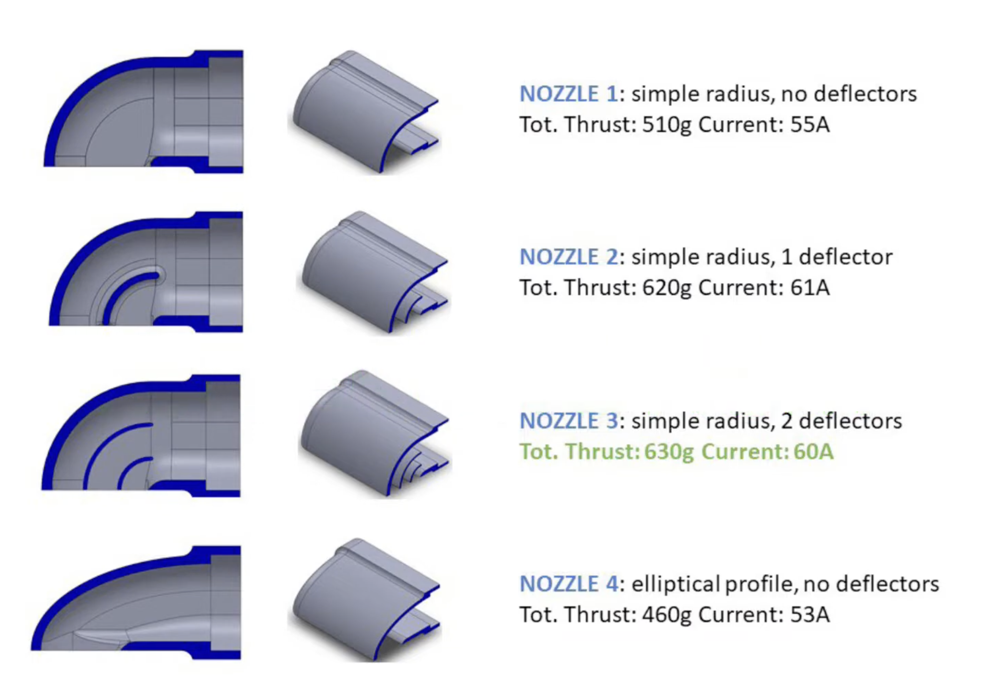

# Devlog

Freeform build journal — newest entry on top. Progress, CAD, things tried-and-ditched, photos,
half-formed ideas. No template to fill; a one-line entry is fine. The crisp "we changed X because Y"
records go in [decisions.md](decisions.md); this is the looser narrative around them.

**Entry format:** `## YYYY-MM-DD — short title`, then a few bullets. Drop images in
`journal/img/` and link them inline.

---

## 2026-07-04 — Internal control-surface leverage worry resolved; torque-sizing caveat noted

- Worried whether going fully internal (no external pushrods/horns, matching the real F-35B) costs
  leverage or max deflection angle vs. an external horn, since an internal horn is boxed in by the
  surface's actual thickness near the hinge line while an external one has unlimited room.
- Worked through the linkage math: torque multiplication and deflection angle are both set by the
  *ratio* of servo-arm radius to horn-arm radius, not the horn's absolute size. Shrink the horn to
  fit inside a thin flaperon/stabilator and shrink the servo arm to match — nothing is lost. A horn
  arm longer than the servo arm (easy at this scale) even multiplies torque above the servo's rated
  spec.
- The real cost of a small horn isn't angle or torque — it's backlash sensitivity (linkage slop
  becomes a bigger angular error at small horn radius) and a practical hardware floor: the 2 mm CF
  rod / M2 clevis hardware already in the BOM needs ~8–10 mm horn radius to mount reliably.
- Also revisited how to know top speed for torque sizing — no way to know it exactly pre-flight,
  but the existing 100 km/h + 3× safety factor already absorbs that (V² scaling means a 30% speed
  error is still well inside 3×). Decided against chasing an exact failure torque or a bench
  pull-test; the analytical margin is enough.
- **Action item:** once the Fusion model exists, check each flight surface's internal depth at the
  hinge line clears an 8–10 mm horn through its full ±25° sweep, and re-run the torque-sizing table
  with real surface area/chord instead of the current pre-CAD estimates.
- Wrote it up in [`docs/05-servos.md`](../docs/05-servos.md#internal-horn-leverage--resolved).
- **Follow-up:** found a comparison write-up pitching a "Rotary Drive System (RDS)" — a bent wire
  direct off the servo spline into a pocket in the control surface, skipping the horn+clevis stage.
  The mechanism is real (used in some scale foamy jets) but "RDS" isn't a term I recognize as
  established RC vocabulary, and the write-up had marketing-flavored overstatements (e.g.
  "mechanical advantage gets stronger as the surface deflects" isn't generally true without a
  specific non-linear geometry; flutter risk is driven mainly by control-surface mass balance and
  overall stiffness, not just linkage type). **Decision: not adopted for v1** — it saves one joint's
  worth of backlash but loses post-build trim adjustability and is tolerance-critical before the
  Fusion geometry exists. Staying with the internal pushrod + horn plan; revisit per-surface only if
  flight testing shows annoying play. Video reference and reasoning added to
  [`docs/05-servos.md`](../docs/05-servos.md#direct-drive-wire-linkage-rds--considered-deferred).
- **Open item surfaced but not yet actioned:** control-surface mass balance (weight ahead of the
  hinge line to counter flutter) isn't documented anywhere yet — it's the primary flutter defense
  regardless of linkage choice. Still needs a home in the docs.
- **Follow-up:** a second write-up detailed why RDS has a reputation for being hard despite looking
  simple — zero-slop pocket fit, hinge-axis alignment of the wire bend (else binding/stall), L/R
  bend-angle asymmetry, and spline-coupler wear. Kept the genuinely useful parts (pocket fit and
  hinge-axis alignment are real; spline wear matches the horn-side hardware-floor concern already
  noted) and corrected an overstated one (L/R asymmetry is trimmed out in software, doesn't
  meaningfully cost servo resolution the way the source claimed). Recorded the two practical
  mitigations (aluminium set-screw coupler, PTFE/brass pocket liner) for if this is revisited in v2.
  Decision unchanged — still deferred for v1.
- **Real-aircraft validation found:** an Aviation Stack Exchange thread on fighter jet flight-control
  actuators confirms full-scale jets use the same basic principle as the chosen Option B — a linear
  (hydraulic, or EHA on newer designs) actuator drives a pushrod into a control horn, converting
  linear motion to rotation. Also picked up a useful detail: the real horn/actuator junction is
  covered by a small streamlined fairing/blister rather than sitting perfectly flush — a tiny
  cosmetic bump at the hinge-line pushrod slot would actually be more scale-accurate than forcing
  it flush. Added as a reference note in
  [`docs/05-servos.md`](../docs/05-servos.md#torque-sizing-why-the-choices-are-right).

---

## 2026-06-28 — Canopy material/forming + cockpit screen filter researched

- **Canopy material: clear PETG, 0.5–0.75 mm.** Chosen for the forming method, not in the abstract —
  forgiving, wide temp window, no pre-drying. Rejected acrylic (shatters cold-bent, needs vacuum +
  oven control) and polycarbonate (must dry, ~50% failure rate). Talked myself into acrylic mid-research
  then back out — PETG is the right call for a hobby setup.
- **Thickness: go thin.** The "scale thickness ~1.3 mm" math is a red herring — invisible at viewing
  distance, and thicker = heavier nose + harder to form + more distortion. Wind load on the canopy at
  RC speed is trivial, so 0.5 mm is structurally fine; 0.75 mm if more rigidity wanted.
- **Single piece** — the real F-35 canopy is a frameless single bubble, so splitting it would *add* a
  seam that isn't there; also easier and optically cleaner to form as one.
- **Tint: clear / very light smoke.** The blue-purple iridescence is a vapour-deposited coating, not
  replicable, and a heavy tint would hide the cockpit screen anyway.
- **Forming: DIY vacuum forming**, not heat-gun draping (single nozzle pulls unevenly → wrinkles).
  Principle worked through: sealed plenum box + perforated top + plug on top + household vacuum; the
  box spreads suction evenly so vac *power* matters less than *seal quality*. Heat **only the framed
  sheet** in the **kitchen oven** (~100–120 °C until it sags), drape over the plug, vacuum on
  immediately, hold ~15 s. (Air fryer too small for a ~220 mm canopy.)
- **Vacuum-box material left UNDECIDED** — plastic tub (cheapest, front-runner), 3D-printed (cleanest
  hole grid + integral hose port, but filament cost is significant and walls are porous → needs epoxy
  seal), or MDF box. Holding off to avoid locking in 3D printing on cost grounds.
- **Opening canopy:** very tempting as a scale detail. Real cost isn't weight — it's **one scarce Pico
  PWM channel** + a hinge, which is why it was cut from V1. Compromise: **V1 = removable, magnet-located**
  (reuses the owned N35 5×2 discs already earmarked for hatches), **powered opening = V2.**
- **Cockpit screen filter:** ST7789 is a transmissive TFT (washed blacks, glare). A ~30–50% smoke
  filter + black bezel helps — but via *ambient rejection* (reflected light double-passes the filter
  ∝ T², emission single-passes ∝ T → image/glare improves by 1/T), **not** the "darkens blacks more"
  explanation that floated around. The tinted canopy already does some of this, so trial bezel-only
  first. Burn-in irrelevant (TFT, not OLED).
- Wrote it up: new Canopy section in `docs/09-materials-airframe.md`, filter note in
  `docs/04-raspberry-pi-pico.md`.

---

## 2026-06-28 — All CF tubes confirmed pultruded; implications documented

- Looked into whether the ordered CF tubes/rods are roll-wrapped or pultruded.
- **6×3mm sleeve tubes:** smooth matte exterior, no woven grid texture → confirmed pultruded.
- **8×6mm spar tubes:** product listing said "3K woven" but the product page photo shows the same
  smooth surface — no weave. "3K" just describes the tow size, not the manufacturing method.
  Confirmed pultruded. The "woven" label was marketing copy.
- **2mm solid rods:** pultruded by default — rolling a 2mm solid rod would be unusual.
- **Conclusion: all CF stock in this build is pultruded.** At this price point and diameter range
  on AliExpress, that's the norm. Roll-wrapped tubes are noticeably more expensive and always show
  the woven grid pattern on the outside.
- **Does it matter?** For spars the load is almost entirely bending — pultruded is actually
  *better* than roll-wrapped there (100% axial fibres = maximum bending stiffness). Torsion on
  the spars is negligible at this scale and planform.
- **Real risk:** radial crushing at mounting points. Pultruded tubes have no hoop fibres, so a
  bare metal screw or tight clamp can split the tube longitudinally. Mitigation: always use
  printed collars/saddles with large bearing surface — never clamp metal directly onto the tube.
- Updated `components/structural.md` (all three CF cards now say pultruded) and added a
  pultruded vs roll-wrapped comparison table + callout to `docs/09-materials-airframe.md`.

---

## 2026-06-28 — Roll-post nozzle shape settled: 2 deflectors

- Found Paolo Raddri's EDF nozzle comparison (he also built an RC F-35B). Tested 4 nozzle geometries
  on a thrust bench:
  - Nozzle 1: simple radius, no deflectors → 510 g / 55 A (9.3 g/A)
  - Nozzle 2: simple radius, 1 deflector → 620 g / 61 A (10.2 g/A)
  - **Nozzle 3: simple radius, 2 deflectors → 630 g / 60 A (10.5 g/A) ✅ winner**
  - Nozzle 4: elliptical profile, no deflectors → 460 g / 53 A (8.7 g/A) — worst
- The deflectors act as turning vanes, preventing flow separation at the 90° bend.
  Nozzle 3 wins on both absolute thrust and efficiency. The elliptical wall alone (Nozzle 4)
  can't stop detachment — hence worse than even the plain radius.
- Absolute thrust values are for Paolo's fan (larger than our 30 mm); the ranking transfers.
- **Decision locked:** roll-post nozzle = simple radius + 2 deflectors. → [decisions.md](decisions.md)

---

## 2026-06-27 — Battery IR baseline logged

- First internal-resistance measurements taken with the HOTA D6 Pro during charge (2 Jun 2026).
- **5000 mAh 6S 70C** — C1 1.5 · C2 1.9 · C3 1.5 · C4 2.2 · C5 2.1 · C6 2.2 mΩ (~11.4 mΩ total). Excellent; 0.7 mΩ spread.
- **2700 mAh 6S 40C** — C1 5.8 · C2 5.9 · C3 4.5 · C4 6.3 · C5 4.6 · C6 4.8 mΩ (~31.9 mΩ total). Photo taken early in the charge cycle so may read a touch high; recheck at rest for a cleaner number. Normal for a 40C/2700 mAh pack.
- Component cards updated with these values as a dated baseline.

---

## 2026-06-26 — Trainer second flight; leftward roll crash again

- Went to school — Aki happened to be there, which turned out useful since he has the sports-hall keys.
- Quick repair from the first crash done on the spot; got the trainer flight-ready.
- First tried the piazza but too cramped — not worth it.
- Moved to the sports hall. It got airborne briefly but curved left again (same as last time) and hit the ground.
- Damage: one prop blade snapped, nose wheel came off — should be a fast fix.
- **Root cause / lesson:** aileron trim is off to the left. Next flight, pre-correct ailerons before launch, and consider a permanent right-trim. Also: sports hall from the start — not the piazza.

---

## 2026-06-26 — BEC specs verified via IC identification

- Photographed the CoreWing V1.85 PDB and read the IC markings directly to close the "8 A or 4 A?" question.
- **Servo BEC controller: SCT2481** (Silicon Content Technology synchronous step-down) — datasheet gives **7.5 A continuous / 14 A peak**. The official manual says 8 A (slightly rounded up); the product page's 4 A was flat wrong. Real value: **7.5 A continuous**.
- **FC BEC: MPS MP9447 family** — 4 A cont / 5 A peak; matches the manual exactly.
- **VTX/CAM BEC: AMGT 155** — 2 A cont / 3 A peak; matches the manual exactly.
- Corroborating evidence on the servo BEC: the **CSD18511Q5A MOSFET** (30 A continuous) next to the SCT2481 — nobody drops a 30 A FET on a 4 A BEC.
- SCT domestic IC initially unreadable in English databases; identified via the Silicon Content Technology (芯洲科技) family (their 8 A buck = SCT2280 series → SCT2481 is a variant in that current class).
- All servos still comfortably within headroom (peak cruise ~4 A, peak transition ~8–10 A). No UBEC split needed.
- Decisions.md + power doc updated to reflect 7.5 A (was "8 A, still worth self-verifying").

---

## 2026-06-24 — Big AliExpress order placed; all in-cart parts ordered

- Ordered everything that was in the cart in one go. Covers:
  - **Lighting** — 3× nav LEDs (white/red/green 3W ×10 each), 10W landing-light, green COB strip (1 m),
    4× ACELEX 700mA drivers, LD2740SC 3A driver, 10× IRLZ44N MOSFET, PP diffuser sheet, 14×14×6 mm
    heatsinks, 2× YiRui 1156 BA15S yellow bulb (afterburner).
  - **Sensors / display** — 20× NTC 100K B3950, 3× ACS712-20A, CD74HC4067 mux board, 1.47″ ST7789 TFT,
    5× 12P FFC adapter.
  - **Servos** — Feetech STS3032 360° (magnetic encoder, 3BSM nozzle), 4× NEEBRC M005 2g plastic gear (light
    doors), 10× 200 mm servo extension.
  - **Roll-post propulsion** — 2× 30 mm EDF 7000KV 3S, 2× FVT LittleBee 20A ESC (bought separately).
  - **Wire** — 10 AWG (2 m), 18 AWG (2 m), 22 AWG (10 m).
  - **Structural** — CF tube 500×8×6 mm ×16, CF rod 2×250 mm ×10, 4 mm steel balls ×100, MR62ZZ ×10,
    38 mm nose wheel ×2, CA glue ×3.
- BOM "In cart" section cleared — all items now in **Owned / ordered** with this date.

## 2026-06-24 — Power architecture & monitoring locked in

- Settled the whole power tree: **two 6S 5000 mAh packs** (one per fan, matched pair), EDFs wired
  **battery → ESC → motor directly** (no high current through the FC), and an **18 AWG avionics tap
  off the lift pack** into the CoreWing PDB for the three BEC rails. Lift pack does double duty
  (hover + avionics) → it's a single point of failure for the electronics, so always fly it connected.
- Monitoring plan finalised: **NTC 100K thermistors through a CD74HC4067 mux** (13 channels, shared
  47 kΩ divider), **3× ACS712 20A** (two on the roll-post EDFs with a ÷0.66 divider, one spare), and
  **resistor dividers** for pack voltage (main 100 k/10 k ×11; 850 mAh 10 k/2 k ×6). Lift voltage
  comes free through the PDB.
- Confirmed the **servo BEC is 8 A continuous** (not the 4 A the product text implied) → no UBEC split.
- Decided **not** to use the smoke stopper here (simple avionics, and it's XT30/XT60 not EC5), and to
  tap voltage dividers at the **ESC power joint, never the balance leads**.
- Started this journal + the [decision log](decisions.md) to stop losing the *why* behind reversals
  (the DS18B20 → NTC switch was the trigger — that reasoning had been deleted from the docs).

## (undated) — Trainer prop-plane, first flight

- The Phase-1 trainer's maiden throw didn't go well: it flew ~1 s, dropped, and broke. Read as a
  **bad throw / not enough launch speed**, not an airframe fault — needs a proper launch (more speed,
  flatter attitude) next attempt. Logged here so the lesson survives the rebuild.

---

<!-- New entries go ABOVE this line, newest first. Template:

## YYYY-MM-DD — title
- what I did / tried
- what worked, what didn't
- decisions → also add a row to decisions.md
- 

-->
